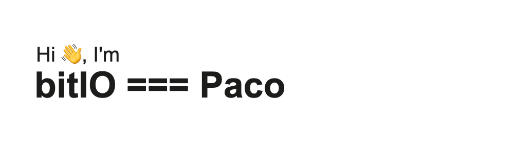

* 👋 Hi, I’m bitIO (born Francisco, know as Paco in the _"real"_ world)
* 📕 I've created software for EU, BBVA and others
* 👀 I’m interested in Building full stack apps that help others
* 🌱 I’m currently learning "Well Architected Framework"
* 💞️ I’m looking to collaborate if you have a great Idea

## Some stats

